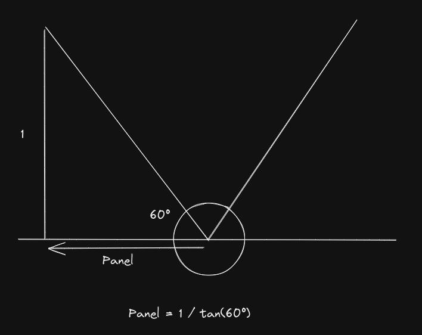
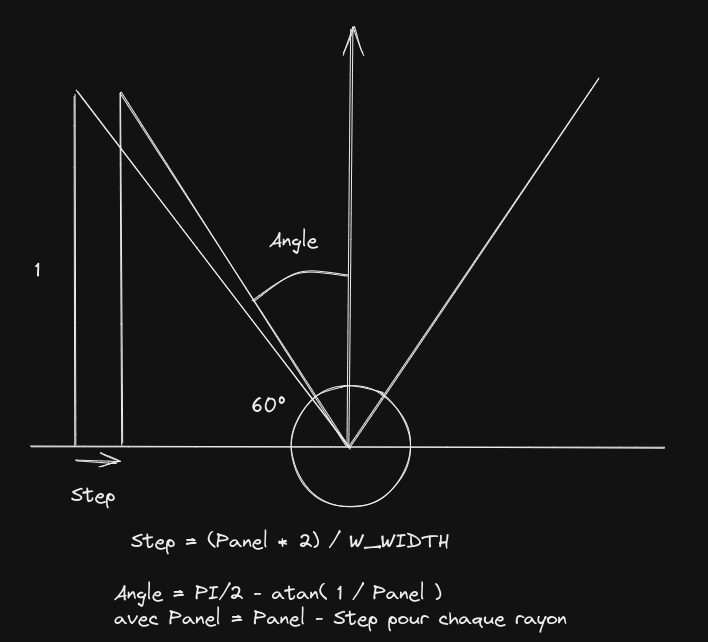

# cube3d

## To do:

- [x]  Verifier algo rayons
- [x]  Algo rayons verticaux et horizontaux
- [x]  projections d’autant de rayons qu’il y a de pixel en largeur
- [x]  Collisions (arret lorsqu'un mur est touche)
- [ ]  Collisions (glissade contre le mur)
- [x]  Pouvoir se deplacer en faisant des rotations
- [x]  Textures
- [ ]  Sprites
- [ ]  Parsing fichier
- [ ]  Minimap
- [ ]  Protection erreur malloc et mlx (avec fermeture propre #freeall)

## Algo projection de rayon

Utilisation d'une liste chainee pour la gestion des sprites.
Chaque rayon lance retourne une liste chaine avec l'ensemble des elements
trouve sur sa trajectoire trie du plus lointain au plus proche.

## Algo projection rayon pour le sol
Calcul des coordonnes theoriques du sol, recuperation de la partie decimal pour la texture.
